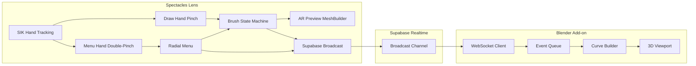

# Spatial Drawer

**Draw in the air on Spectacles. Watch it build itself in Blender.**

Spatial Drawer is a Snap Spectacles prototype that turns pinch gestures into real 3D curves inside a live Blender scene. The Lens tracks your fingertip, renders a smooth tube/ribbon/polyline preview in AR as you draw, and streams every point over a Supabase Realtime channel to a Blender add-on that builds the actual curve geometry as you go. Grab, erase, recolor, and undo strokes from the headset — Blender mirrors it all in real time.

No local network requirement. No cable. Just Spectacles, a free Supabase project, and a Blender scene.

## Demo

[Watch the Spatial Drawer demo video](https://drive.google.com/file/d/1SwWEaLa105HjnVTBlm_nKs6ekQ2jheOK/view?usp=drive_link)

## What It Feels Like

```txt
pinch to draw a stroke in mid-air
double-pinch the menu hand to open the radial menu
pick a brush, size, or color
draw again — Blender is already building the curve
pinch-hold a stroke to grab and move it
tap Export — a finished .fbx lands on your Desktop
```

Spatial Drawer treats a hand pinch as a spatial input event, not a UI click. Every stroke, grab, erase, and undo is a small JSON packet broadcast to whoever is listening — right now that's a Blender add-on, but the protocol doesn't care what's on the other end.

## Feature Snapshot

| Area | Current Support |
| --- | --- |
| Brushes | Tube, ribbon, polyline (Bezier), eraser |
| Tube brush | ATC-style 3D mesh, per-vertex normals, twist-stable reference vectors |
| Ribbon brush | Flat strip that tilts with hand orientation, incremental append |
| Polyline brush | Tap to place Bezier anchors, drag to shape handles |
| Brush size | 5 presets (XS-XL), radial sub-menu |
| Color | Palette picker, applied to AR preview and Blender material |
| Grab | Bounding-box pinch grab, moves AR trail and Blender object together |
| Menu | 10-button radial menu, double-pinch to open |
| Origin | Draggable gizmo, re-anchors all existing curves in Blender |
| Undo | Pops the last stroke from both AR and Blender |
| Export | One tap merges all curves into a single `.fbx` on the Desktop |
| Multiplayer | Per-user color assignment in Blender via `userId` |
| Transport | Supabase Realtime broadcast (WebSocket, no LAN required) |

Not yet implemented:

- generative AI mesh pipeline (Tripo3D integration existed in an earlier phase, since removed)
- persistent stroke storage across sessions
- collaborative cursors / presence indicators in AR
- automatic Blender scene reconnection after a dropped socket

## Architecture



## Repository Layout

```txt
Spatial Drawer/
├── Assets/
│   ├── SpatialDrawer.js              main Lens script: hands, brushes, radial menu, broadcast
│   ├── Spectacles Radial Menu.js     third-party radial menu widget (Max van Leeuwen)
│   └── ...                           materials, meshes, textures, icons
├── blender_plugin/
│   └── spectacles_bridge.py          Blender add-on: WebSocket listener + curve builder
├── docs/                             setup, protocol, architecture, testing
├── Spatial Drawer.esproj             Lens Studio project
├── CHANGELOG.md
└── README.md
```

## Quick Start

### 1. Create a Supabase Project

1. Create a free account at [supabase.com](https://supabase.com/).
2. Create a new project.
3. In **Project Settings > API**, copy the **Project URL** and the **anon public key**.
4. Realtime broadcast is enabled by default — no extra configuration needed.

### 2. Configure the Lens

1. Open `Spatial Drawer.esproj` in Lens Studio.
2. Select the `SpatialDrawer` script in the scene hierarchy.
3. Drag your Supabase credentials asset into the **Supabase Project** input.
4. Leave **Channel Name** as `spatial-drawer`, or set your own — it must match the Blender side.
5. Push to Spectacles via Interactive Preview, or publish the Lens.

### 3. Install the Blender Add-on

```txt
Edit > Preferences > Add-ons > Install...
select blender_plugin/spectacles_bridge.py
enable the checkbox
```

Open the **Spectacles** tab in the 3D Viewport sidebar (`N` panel). If this is the first run, click **Install WebSocket Library** and restart Blender.

### 4. Connect

In the Blender panel, enter the same **URL**, **anon key**, and **channel** used in the Lens, then click **Start Listening**.

### 5. Draw

```txt
pinch draw hand           -> start/continue a stroke
release pinch             -> end stroke
double-pinch menu hand    -> open radial menu
hold draw-hand pinch 1s   -> enter grab mode on the last stroke
```

Every stroke you draw on Spectacles appears in the Blender viewport within one broadcast round-trip.

## Radial Menu Reference

```txt
Brushes   -> sub-menu: Tube, Ribbon, Polyline, Eraser
Size      -> sub-menu: XS, S, M, L, XL (tube/ribbon/polyline radius)
Grab      -> toggles grab mode, restores previous brush on exit
Colors    -> sub-menu built from colorPaletteParent children
Origin    -> re-anchors the workspace grid and all existing curves
Export    -> merges all curves into one .fbx on the Desktop
Undo      -> removes the most recent stroke
Clear All -> removes every stroke from AR and Blender
Preview   -> toggles AR trail visibility (Blender keeps building regardless)
Hands     -> swaps which hand draws and which opens the menu
```

See [docs/lens-setup.md](docs/lens-setup.md) for how each button is wired to a `SceneObject` input.

## Protocol

Every gesture becomes a `draw-event` broadcast over the Supabase channel:

```json
{
  "action": "move",
  "x": 12.4, "y": 5.1, "z": -3.2,
  "userId": "user_ab12cd",
  "brushMode": "tube",
  "curveId": "curve_user_ab12cd_1750000000000",
  "thickness": 1.0,
  "ts": 1750000000000
}
```

Action types: `start`, `move`, `end`, `bezier-add`, `bezier-move`, `erase`, `grab-start`, `grab-move`, `grab-end`, `cancel-last`, `undo`, `clear-all`, `set-color`, `set-origin`, `export`. Full field reference in [docs/protocol.md](docs/protocol.md).

## Developer Notes

Useful docs:

- [Concept](docs/concept-note.md)
- [Lens Setup](docs/lens-setup.md)
- [Blender Setup](docs/blender-setup.md)
- [Architecture](docs/architecture.md)
- [Protocol](docs/protocol.md)
- [Testing Checklist](docs/testing-checklist.md)
- [Development](docs/development.md)
- [Contributing](CONTRIBUTING.md)
- [Changelog](CHANGELOG.md)

## Notes And Risks

Spatial Drawer is a prototype, not a production creative tool.

The hard parts are exactly the fun parts:

- keeping the tube mesh twist-free across sharp direction changes
- bounding-box grab accuracy once a scene has many overlapping strokes
- coordinate conversion between Lens Studio (Y-up) and Blender (Z-up)
- WebSocket reconnection if Blender's listener drops mid-session

Quick fixes when testing:

- if strokes stop appearing in Blender, check that **Start Listening** is still active and the channel name matches on both sides
- if the tube mesh looks pinched, the hand moved faster than `DRAW_MIN_DIST` sampling can smooth — this is a known limit, not a bug
- recalibrate the origin gizmo if the grid drifts from the physical surface
