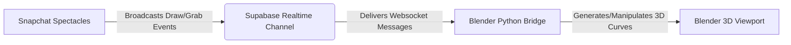

# ✏️ Spatial Drawer: Real-time AR to Blender Drawing

**Spatial Drawer** is a real-time collaborative 3D sketching tool for **Snapchat Spectacles** that bridges augmented reality (AR) drawing with professional 3D workflows in **Blender**. Draw tubes, ribbons, or tapped polyline curves in physical space, and watch them materialize instantly in your Blender scene.

---

## 🏗️ Architecture

The project connects Lens Studio and Blender using a real-time, low-latency publish-subscribe channel over websockets:

---

## ✨ Key Features

*   **Diverse Brush Types with smooth AR preview:**
    *   **Tube Brush:** ATC-faithful 3D tube mesh with per-vertex normals and stable reference vectors for smooth, twist-free strokes in AR.
    *   **Ribbon Brush:** Camera-tilt-aware flat ribbon strip that follows hand orientation in real-time.
    *   **Polyline Brush:** Tap to place Bezier anchor points; each segment renders as a 3D tube between tapped positions.
    *   **Eraser:** Pinch near any drawn line to delete it instantly from both AR and Blender.
*   **Brush Size Control:** 10-button radial menu includes a dedicated Size button with XS / S / M / L / XL sub-options. Size affects the AR preview only — Blender manages its own curve radius independently.
*   **Stroke Color in AR:** Selected palette color is applied to each new stroke's preview material, so what you see in AR matches the color broadcast to Blender.
*   **Custom Grab & Move System:** Bypasses physics-based raycasts (which fail on 1D curves) using dynamic bounding boxes. Pinch near any curve to grab, translate, and move it in real-time.
*   **10-Button Radial Menu:** Double-pinch to open — Brushes, Size, Colors, Grab, Preview, Clear All, Export, Undo, Origin, Swap Hands. Clear All lives on the main ring for one-tap access.
*   **Set Workspace Origin:** Align the virtual grid to any physical surface using the draggable origin gizmo.
*   **One-Tap FBX Export:** Tap "Export" in AR to automatically merge, clean, and export all drawn curves as a single `.fbx` mesh directly to your Desktop.
*   **Stable Blender Plugin (`v1.1.0`):** Proper `bl_info` header so the plugin installs and activates correctly via Blender's Add-on manager without any Text Editor workaround.

---

## 📋 Changelog

### Phase 1

**Blender Plugin (`spectacles_bridge.py`) — v1.1.0**
- Added `bl_info` metadata block — plugin now installs cleanly via **Edit > Preferences > Add-ons > Install** and shows up in the add-on list with version, author, and category.
- Implemented `clear-all` event handler — pressing **Clear All** in AR now removes all curves from Blender's scene and resets the curve registry, active strokes, and undo stack in one go.

**Lens Studio (`SpatialDrawer.js`) — AR Preview overhaul**
- **Smooth tube brush:** Replaced 1px LineStrip preview with an ATC-faithful 3D tube using `TriangleStrip` + per-vertex normals. Stable reference vectors prevent twisting on direction changes. Same algorithm as the Air Traffic Controller project's trail builder.
- **Ribbon brush:** Flat 2D ribbon strip that tilts with hand forward direction — incremental append per sample, no full rebuild.
- **Polyline tube:** Each tapped anchor point adds a segment of the 3D tube, rebuilt from all anchors on every tap.
- **10-button radial menu:** Expanded from 8 to 10 buttons. Clear All promoted to a dedicated main ring button. New Size button opens a sub-menu with 5 stroke width presets (XS → XL) auto-detected from a `sizePaletteParent` SceneObject, same pattern as the color palette.
- **Stroke color in AR:** Picking a color from the palette now sets `mainPass.baseColor` on each new stroke's cloned preview material — AR preview color matches the broadcast color.
- Radial menu button hover state cleanup — action buttons return to `default` state after press; only radio/toggle buttons (brush type, size, Preview, Handedness) hold active state.

---

## 🚀 Setup Instructions

### 1. Supabase Realtime Backend Setup
1. Create a free account at [Supabase](https://supabase.com/).
2. Create a new project.
3. In your Supabase Dashboard, go to **Project Settings** > **API** and copy:
   * **Project URL** (`https://<project-id>.supabase.co`)
   * **Anon Public API Key**
4. Enable the **Realtime** service for your project (by default, public broadcast channels are enabled).

---

### 2. Lens Studio (Spectacles) Setup
1. Open the project in **Lens Studio 5.x**.
2. Locate the `SpatialDrawer` script in the scene hierarchy.
3. In the Inspector, locate the **Supabase Project** asset field.
4. Input your **Supabase URL** and **Anon API Key** into the project credentials asset.
5. (Optional) Customize the channel name (defaults to `spatial-drawer`).
6. Push the project to your Spectacles device using the **Interactive Preview** or by publishing an Lens.

---

### 3. Blender Add-on Setup
1. Locate the bridge script in this repository: [spectacles_bridge.py](blender_plugin/spectacles_bridge.py).
2. Open Blender (v3.6+ or v4.x recommended).
3. Go to **Edit** > **Preferences** > **Add-ons** > **Install...** and select `spectacles_bridge.py`, then enable it. (Alternatively, run it directly in Blender's Text Editor).
4. Locate the **Spatial Drawer** tab in the Sidebar (`N` panel in the 3D Viewport).
5. If running for the first time, click **Install WebSocket Library** to install the required dependency.
6. Enter your **Supabase URL**, **Anon Token**, and **Channel Name**.
7. Click **Start Listening** 🟢.

---

## 🎮 How to Use (Gestures & Interaction)

*   **Double-Pinch (Menu Hand):** Opens the circular radial menu at your hand.
    *   Hover over options to highlight.
    *   Pinch to select/press.
*   **Pinch (Draw Hand):** Draws in space using the currently selected brush.
*   **Pinch & Hold (Draw Hand, 1 second):** Initiates legacy grab mode to move the active curve.
*   **Grab Tool Mode:** 
    1. Select the **Grab Tool** from the radial menu.
    2. Pinch your drawing hand close to any curve.
    3. Drag to translate the curve in AR and Blender concurrently.
    4. Release pinch to drop.
*   **Adjust Workspace Origin:** Drag the physical green/red gizmo to snap the grid floor and align all coordinate spaces.

---

## 🛠️ Troubleshooting

> [!WARNING]
> If Blender displays an error about `websocket-client` missing even after clicking the installation button:
> * Close Blender.
> * Run Blender as an Administrator (Windows) or via terminal with `sudo` (macOS/Linux) and click the **Install WebSocket Library** button again.
> * Alternatively, run:
>   `blender_python_path -m pip install websocket-client` using Blender's internal Python executable.

> [!NOTE]
> Ensure both your Spectacles and the computer running Blender are connected to the internet. Since Supabase Realtime uses cloud websockets, they do not need to be on the same local network.
