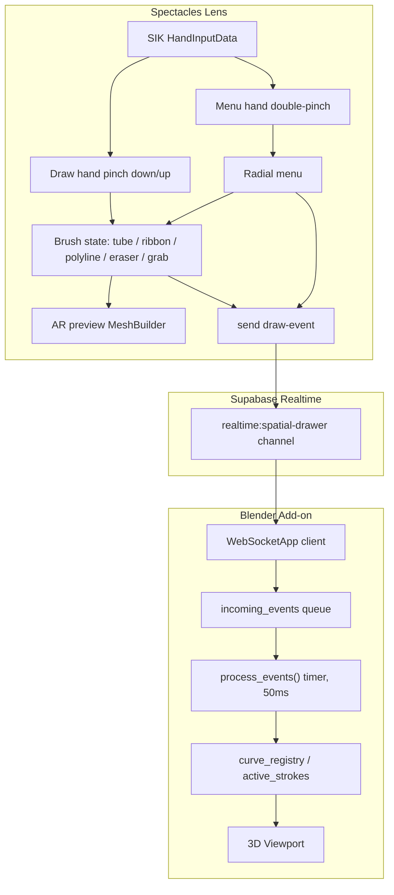

# Architecture

Spatial Drawer has two runtime pieces connected by a cloud relay:

1. A Lens Studio Spectacles Lens (`Assets/SpatialDrawer.js`).
2. A Blender add-on (`blender_plugin/spectacles_bridge.py`).

They never talk to each other directly. Both connect to the same Supabase Realtime broadcast channel; the Lens only sends, the add-on only receives.



## Lens Components

`SpatialDrawer.js`

- owns hand tracking bindings for both hands via `SIK.HandInputData`
- runs a brush state machine: `tube | ribbon | polyline | eraser | grab`
- builds and updates the AR preview mesh locally every frame a stroke is active
- builds the 10-button radial menu and wires each button's `onPress` / `onPressAndClosed` callback
- broadcasts every gesture as a `draw-event` JSON payload over the Supabase channel
- never waits for a response — the Lens has no knowledge of what Blender does with the data

`Spectacles Radial Menu.js`

- third-party radial menu widget (Max van Leeuwen), wrapped rather than modified
- `SpatialDrawer.js` wraps each input `SceneObject` in an empty parent before handing it to the widget, so the widget's rotation logic doesn't clobber custom button rotations

## AR Preview Mesh Building

Two independent mesh strategies run depending on brush:

- **Tube** (`rebuildTubeMesh`): full rebuild every sample. Maintains a stable reference vector per point (`getStableTubeRef`) so the tube cross-section doesn't twist on sharp turns — same technique as the Air Traffic Controller project's trail builder.
- **Ribbon** (`onUpdate` ribbon branch): incremental append, two vertices per sample, no full rebuild. Cross-section tilts toward the hand's forward vector.
- **Polyline** (`rebuildPolyTube`): rebuilt from `polyAnchorPoints` on every tap, not every frame — anchors are Bezier points, not continuous samples.

The AR preview is cosmetic. It never determines what's drawn in Blender; it can be toggled off entirely (`Preview` button) while broadcast keeps streaming.

## Blender Components

`spectacles_bridge.py`

- registers a Blender panel (`SPECTACLES_PT_panel`) under **3D Viewport > Sidebar > Spectacles**
- opens a `websocket.WebSocketApp` to the Supabase Realtime endpoint on **Start Listening**
- `on_message` pushes every `draw-event` payload onto a plain list, `incoming_events`
- `process_events()` is a Blender app timer (runs every 0.05s) that drains that list and mutates the scene — this keeps all `bpy` calls on Blender's main thread, since the WebSocket runs on a background thread
- maintains `curve_registry` (curveId to Blender object + anchor position) and `active_strokes` (curveId to in-progress spline) so `move` events can append to the right curve
- `drawn_stack` is a simple undo stack of curveIds

## Coordinate System

Lens Studio is Y-up; Blender is Z-up. `world_to_blender()` converts every incoming point:

```txt
bx =  (x - origin.x) * scale
by = -(z - origin.z) * scale
bz =  (y - origin.y) * scale
```

`scale` and `origin` are both scene-level Blender properties (`spectacles_scale`, set via `set-origin` events). Vectors (like Bezier handle deltas) skip the origin subtraction since they're relative, not absolute — see the `bezier-move` handler for the vector-only variant of this same swap.

## Grab System

Grab has two independent implementations that share one wire protocol:

- **Manual grab** (`brushMode === "grab"`): the Lens computes a bounding-box hit test against all local AR preview trails (`previewTrails`), moves the `SceneObject` directly in AR, and streams `grab-move` packets with the object's absolute world position. Blender applies the same absolute position via `grabbed_offset` math, computed once at `grab-start`.
- **Legacy hold-to-grab**: holding the draw-hand pinch for `GRAB_HOLD_SEC` (1s) without moving past a distance threshold cancels the last stroke and enters the same grab flow without requiring the radial menu.

Both converge on the same `grab-start` / `grab-move` / `grab-end` actions in the protocol — Blender's handler doesn't distinguish which one triggered it.

## Transport Notes

Spatial Drawer uses Supabase Realtime broadcast (a hosted WebSocket relay) instead of a direct local WebSocket server. This means:

- Spectacles and the Blender machine do not need to share a network — Supabase is the relay, both sides just need internet
- multiplayer is close to free: every connected client with the same channel name receives every broadcast, and `userId` in each payload is enough to assign per-user colors in Blender
- there is no persistence — if nobody is listening when a packet is sent, it's gone. Blender must be actively listening to catch strokes drawn while it's offline

An earlier phase used a local Node.js server for the same relay job; it was removed in favor of Supabase Realtime once multiplayer and internet-independent testing became requirements (see `CHANGELOG.md` history and the empty `server/` directory left over from that phase).
